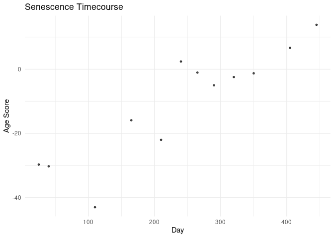

- [Introduction](#introduction)
- [Data acquisition, age-prediction, and
  processing](#data-acquisition-age-prediction-and-processing)
  - [Loading libraries](#loading-libraries)
  - [Getting GEO ExpressionSet](#getting-geo-expressionset)
  - [Converting gene ids using
    biomaRt](#converting-gene-ids-using-biomart)
  - [Preparing data for
    age-prediction](#preparing-data-for-age-prediction)
  - [Creating metadata and predict
    ages](#creating-metadata-and-predict-ages)
  - [Reshaping to long format](#reshaping-to-long-format)
- [Results](#results)
  - [Computing correlations](#computing-correlations)
  - [Visualization](#visualization)

# Introduction

This tutorial demonstrates an analysis using the **Pasta** package on
the dataset **GSE41714** from Kim, *Aging Cell*, 2013.  
The study, *“Implications of time-series gene expression profiles of
replicative senescence”*, is available at
[GEO](https://www.ncbi.nlm.nih.gov/geo/query/acc.cgi?acc=GSE41714) and
[Aging Cell](https://onlinelibrary.wiley.com/doi/10.1111/acel.12087).

# Data acquisition, age-prediction, and processing

In this section, we load the GEO ExpressionSet, extract the expression
matrix, and inspect the phenotype data.

## Loading libraries

``` r
library(pasta)
library(jsutil)
library(magrittr)
library(data.table)
library(ggplot2)
library(gtools)
library(GEOquery)
library(biomaRt)

# Create output directory if needed
if (!dir.exists("../output")) {
  dir.create("../output")
}
```

You can install any missing packages using `install.packages()` for CRAN
packages (`magrittr`, `data.table`, `ggplot2`, `gtools`),
`BiocManager::install()` for bioconductor packages (`GEOquery`,
`biomaRt`), or `devtools::install_github()` for GitHub packages
(`pasta`, `jsutil`).

## Getting GEO ExpressionSet

``` r
file_Kim2013 = '../output/ES_Kim2013.rds'
if(!file.exists(file_Kim2013)){
  dir.create('../output', showWarnings = F)
  # Load the ExpressionSet for GSE41714 using GEOquery
  ES <- getGEO('GSE41714', GSEMatrix = TRUE, getGPL = FALSE)[[1]]
  # Extract the expression matrix and display dimensions
  saveRDS(ES, file_Kim2013)
}
```

## Converting gene ids using biomaRt

In this section, we use **biomaRt** to query Ensembl and convert
Illumina HumanHT-12 V4 probe IDs to Ensembl gene IDs.

``` r
file_humanht12v4 = '../output/dt_ids__humanht_12_v4.rds'

if(!file.exists(file_humanht12v4)){
  
  ES = readRDS(file_Kim2013)
  mat <- exprs(ES)
  
  # Load Ensembl using the Pasta helper function
  ensembl <- get_mart_ensembl_human()
  check_biomart_attributes(ensembl, 'v4') 

  # If no results, try a different Ensembl version:
  ensembl_109 <- useEnsembl(biomart = 'genes', dataset = 'hsapiens_gene_ensembl',
                            version = 110)
  check_biomart_attributes(ensembl_109, 'v4')

  # Use an older version if needed:
  ensembl_108 <- useEnsembl(biomart = 'genes', dataset = 'hsapiens_gene_ensembl',
                            version = 105)
  check_biomart_attributes(ensembl_108, 'v4')
  # Expected output should list 'illumina_humanht_12_v4' as a probe.

  # Convert gene IDs using the provided function
  dt_ids <- converting_gene_ids_to_ensembl_gene_ids(mat, ensembl_108, 'illumina_humanht_12_v4')
  saveRDS(dt_ids, file_humanht12v4)
}
```

## Preparing data for age-prediction

Here we update the ExpressionSet and filter genes using the pasta
functions.

``` r
ES = readRDS(file_Kim2013)
dt_ids = readRDS(file_humanht12v4)
mat <- exprs(ES)

# Rename rows in the expression matrix using the conversion table and filter genes
mat1 <- renaming_rows_in_mat_after_gene_id_conversion(mat, dt_ids) %T>% pdim # 23,680 genes, 12 samples
```

    ## [1] 23680    12

``` r
mat2 <- filtering_age_model_genes_and_rank_norm(mat1) %T>% pdim # 8,113 genes x 12 samples
```

    ## [1] 8113   12

``` r
# Extract phenotype data
pdata <- pData(ES) %>% setDT
pdata1 <- pdata[, 31] %>% set_colnames('population_doubling')
```

## Creating metadata and predict ages

We now define a metadata table made using Figure 1A and 1B of the
[manuscript](https://onlinelibrary.wiley.com/doi/10.1111/acel.12087). It
contains information about days, doubling time, cell passage, and
beta-galactosidase measurements (a proxy for senescence).

``` r
# Define a table with metadata information
dt_beta_gal <- data.table(
  doubling_time  = c(2, 2, 3, 5, 7, 10, 12, 14, 15, 20, 30, 40),
  nb_of_passages = c(16, 22, 54, 67, 75, 79, 81, 83, 85, 87, 88, 89),
  betagal_low    = c(0, 0, 0, 0, 12, 20, 42, 44, 45, 77, 79, 90),
  betagal_high   = c(0, 0, 0, 0, 0, 2, 7, 3, 8, 44, 45, 63),
  day            = c(25, 40, 110, 165, 210, 240, 265, 290, 320, 350, 405, 445)
)
# Check if the doubling times match
all.equal(as.numeric(pdata1$population_doubling[1:11]), dt_beta_gal$doubling_time[1:11])  # should be TRUE
```

    ## [1] TRUE

``` r
# Predicting age-effects and adding these to the metadata table
pdata1 <- copy(dt_beta_gal)
pdata1 %<>% adding_age_preds_to_pdata(t(mat2), CT46 = TRUE) %T>% pdim # 12 samples, 8 columns
```

    ## [1] 12  8

``` r
print(pdata1)
```

    ##     doubling_time nb_of_passages betagal_low betagal_high   day      REG      PASTA     CT46
    ##             <num>          <num>       <num>        <num> <num>    <num>      <num>    <num>
    ##  1:             2             16           0            0    25 25.83056 -29.713817 7.695371
    ##  2:             2             22           0            0    40 25.98678 -30.284086 7.911505
    ##  3:             3             54           0            0   110 29.37417 -43.067968 7.871557
    ##  4:             5             67           0            0   165 37.40867 -15.918183 7.724767
    ##  5:             7             75          12            0   210 36.62067 -22.021719 7.082496
    ##  6:            10             79          20            2   240 58.08863   2.399004 6.861439
    ##  7:            12             81          42            7   265 60.45208  -1.046527 7.838369
    ##  8:            14             83          44            3   290 50.25965  -5.033131 7.842956
    ##  9:            15             85          45            8   320 49.35180  -2.435263 7.397445
    ## 10:            20             87          77           44   350 61.11801  -1.298330 8.168307
    ## 11:            30             88          79           45   405 54.22468   6.647604 7.150364
    ## 12:            40             89          90           63   445 60.96025  13.854523 7.937065

## Reshaping to long format

``` r
pdata1_long <- melt(pdata1, id.vars = names(dt_beta_gal), 
  variable.name = 'model_type')
pdata1_long <- pdata1_long[model_type == 'PASTA']
pdata1_long1 <- melt(pdata1_long, id.vars = c('model_type', 'value'),
  variable.name = 'outcome', value.name = 'outcome_value')
```

# Results

## Computing correlations

``` r
# Compute Pearson correlations for each outcome by model_type
dt_cor <- pdata1_long1[, .(PCC = cor(value, outcome_value)), by = .(model_type, outcome)][order(-PCC)]
# Clean up outcome names for readability
dt_cor[, outcome := outcome %>% gsub('_', ' ', .) %>% gsub('beta', 'B', .) %>% gsub('nb of ', '', .)]
dt_cor[, outcome := factor(outcome, levels = rev(as.character(dt_cor[model_type == 'PASTA']$outcome)))]
print(dt_cor)
```

    ##    model_type       outcome       PCC
    ##        <fctr>        <fctr>     <num>
    ## 1:      PASTA           day 0.8957298
    ## 2:      PASTA      Bgal low 0.8430683
    ## 3:      PASTA doubling time 0.8267029
    ## 4:      PASTA      passages 0.7873572
    ## 5:      PASTA     Bgal high 0.6772058

## Visualization

``` r
# Plot predicted age scores (from the PASTA model) against the day variable
p_cor_sen_day_2 <- ggplot(pdata1_long1[outcome == 'day'], aes(x = outcome_value, y = value)) + 
  xlab('Day') + 
  ylab('Age Score') + 
  geom_point(size = 1, alpha = 0.7) + 
  ggtitle('Senescence Timecourse') +
  theme_minimal()

print(p_cor_sen_day_2)
```

<!-- -->
